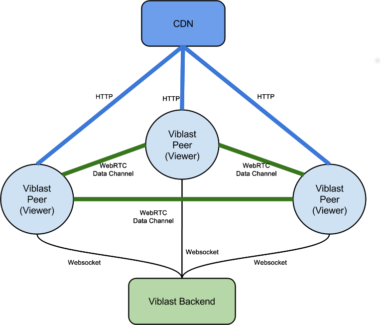
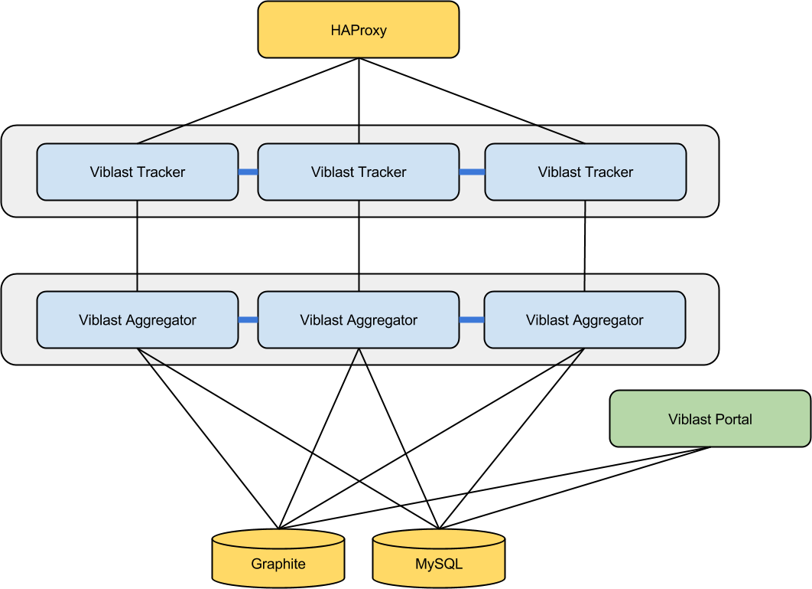

# Viblast Backend Installation and Configuration
#### (draft)

## Overview
Viblast technology adds peer-to-peer layer on top of existing video
streaming infrastructure transforming this infrastructure into peer
assisted CDN - Viblast PDN. 

Each Viblast peer (viewer) connects to the Viblast backend using
Websocket protocol. This connection is used for:

* introducing Viblast peers to each other and helping them to establish
  WebRTC data channel connections
* reporting metrics data from Viblast peers - traffic data, QoE data, etc.

It is important to note that Viblast peer’s connection to Viblast backend
is not used for transferring any video data. All video data is transferred either
from the CDN or between peers using WebRTC data channel connections.

Video playback does not depend on Viblast backend. If some Viblast peers
could not establish connection to the Viblast backend they still be able
to play video using CDN connection.

## Viblast Backend Structure
Viblast backend consists of several applications - Viblast Tracker,
Viblast Aggregator and Viblast Portal.

### Viblast Tracker
Each Viblast peer (viewer) connects to Viblast tracker using Websocket
protocol and keeps this connection while consuming video stream. Viblast
tracker introduces peers to each other and helps them to establish
peer-to-peer connections. Viblast peers regularly announce to the tracker
which video segment they are playing, amount of data they have downloaded
from the CDN and from other peers, how much data they have uploaded to other
peers, QoE data, etc. As a response the peer receives a set of other peers that are
suitable for establishing peer-to-peer connections.

### Viblast Aggregator
The purpose of Viblast Aggregator is to aggregate data reported by Viblast
peers (viewers) into usable and easy to comprehend metrics. Each metric is
aggregated as time series data by minute interval. Common metrics collected
and stored by the Viblast aggregator are:

* Number of viewers for given stream
* Number of viewers for given stream by quality
* Amount of data downloaded from the peer-to-peer network
* Amount of data downloaded from CDN
* Browser usage for given stream
* Browser usage for given stream by quality

Metrics time series data is stored into Graphite (<https://github.com/graphite-project>).

### Viblast Portal
Viblast Portal helps to create and manage streams and to visualize metrics
data collected by Viblast Aggregator.

## Viblast Backend Deployment
Viblast backend is deployed on Linux servers. All following examples assume
usage of Ubuntu 14.04LTS. Support for other distributions is available
on request.

Viblast tracker and Viblast aggregator are distributed as Erlang
applications. Viblast portal is a Python/Django application. Additionally
the Viblast backend requires MySQL server and Graphite.

Viblast backend supports different deployment architectures.

### Single Node Deployment
For not very large deployments for max ~20000 viewers
the recommended deployment is single node deployment.

### Multi Node Deployment without Clustering

For cases when more than 50000 concurrent viewers should be handled
Viblast backend supports multi node deployments. Viblast backend can be
deployed on multiple independent nodes and load balanced using HAProxy
or other load balancer.

Avoiding the usage of Viblast backend clustering support makes the
deployment more simple, but has some shortcomings that are discussed below.

### Multi Node Deployment with Single Aggregator
Viblast aggregator can be connected to multiple tracker nodes and collect
data from all of them. This is the simplest multi node deployment
architecture, but obviously it does not scale well. 
We do not recommend to connect one Viblast aggregator to more than
three tracker nodes.

")

### Multi Node Deployment with Independent Aggregators
When single aggregator deployment is insufficient, deployment with multiple
aggregators is available. Again, not using clustering support in Viblast
backend simplifies the deployment architecture, but comes with some
shortcomings.

In this particular case, the main disadvantage is that each Viblast
aggregator produces independent data, that should be additionally
aggregated.

")

### Multi Node Cluster Deployment

Viblast backend supports building clusters from Viblast tracker nodes
and from Viblast aggregator nodes. This deployment is recommended for
production loads above 100K concurrent viewers. 

Viblast backend clustering supports adding nodes to the cluster in the
runtime, inspecting the state of the nodes in the cluster, replacing nodes
in the cluster, etc.

## Viblast Backend Common Settings

### Create Viblast user
All the Viblast backend should be run by unprivileged user. So it is
common to create a `viblast` user and to run all backend application as
`viblast` user.

To create the `viblast` user:

	sudo adduser --disabled-password --gecos '' viblast

### Controlling System Limits

Viblast tracker installations running production workloads may need system
limits and kernel parameters tuning in order to handle a decent number of
concurrent connections. The main setting that needs adjustment is the max
number of open files, also known as `ulimit -n`. The default value on
many operating systems is too low for a Viblast tracker (eg. 1024 on
several Linux distributions).

To increase the limit of the maximum number of open files edit the
`/etc/security/limits.conf` and change the lines that specify nofile
limits or add them is they are not set:

	*               soft    nofile          1048576
	*               hard    nofile          1048576
	root            soft    nofile          1048576
	root            hard    nofile          1048576

Additionally we need to tune Linux kernel networking parameters to support
large number of simultaneous connections:

	net.core.rmem_max=16777216
	net.core.wmem_max=16777216
	net.ipv4.tcp_rmem=4096 87380 16777216
	net.ipv4.tcp_wmem=4096 65536 16777216
	net.ipv4.tcp_syncookies=1
	net.ipv4.tcp_mem=50576   64768   98152
	net.core.netdev_max_backlog=2500
	
## Viblast Tracker Deployment

Viblast tracker application is distributed as generic Linux tar package
`vbt.tar.gz`. The current build supports Ubuntu Linux 14.04 LTS.
Builds for other Linux distributions are available on request.

### Viblast Tracker Node

To install untar the package into a directory (for example in `/opt`).
The created directory structure is:

	vbt
	├── bin
	├── data
	├── erts-6.4
	├── etc
	├── lib
	├── log
	└── releases

Tracker configuration is stored in `vbt/etc` directory. Scripts for
starting/stopping viblast tracker are found in vbt/bin directory.
By default the logs are stored in `vbt/log` directory and `vbt/data`
contains some runtime data about Viblast tracker cluster. The position
of these directories could be configured.

### Viblast Tracker Configuration Files

Viblast tracker is configured in using following files:

	vbt/etc/
	├── vm.args
	└── app.config

#### vm.args
A fragment of `vm.args` with default values is shown below:

	## Name of the node
	-name vbt0@127.0.0.1

	## Cookie for distributed erlang
	-setcookie vbt

These parameters are used when connecting tracker and aggregator nodes
or when building tracker cluster. If you plan to connect viblast aggregator
to this node or other tracker nodes to this node you have to change these
parameters. 

The first parameter is node name. If private IP address of server is
`172.16.0.17`, then suitable node name would be `vbt0@172.16.0.17`.

The second parameter is setcookie parameter. This parameter is a shared
secret parameter. All nodes that should be connected to each other have
to share the same secret. A suitable value for this parameter is some
secret hash. In our example we will set this to
`74b87337454200d4d33f80c4663dc5e5`.
So the fragment of `vm.args` should be changed to:

	## Name of the node
	-name vbt0@172.16.0.17

	## Cookie for distributed erlang
	-setcookie 74b87337454200d4d33f80c4663dc5e5

#### app.config

The other configuration file is app.config. The important fragment of
this configuration file is:

	{vbt, [
		{tracker_listen_port, 2910 },
		{tracker_ssl_listen_port, undefined }
    ]}

This fragment specifies the port where viblast tracker listens for
incoming websocket connections. By default Viblast expects tracker to
listen for websocket connections on port `2910` and for secure websocket
connections on port `2913`.

Our recommendation is to use viblast tracker behind HAProxy. So the HAProxy
will be configured to listen on ports 2910 for websocket connections and
on port `2913` for secure websocket connections and forward this connections
to the tracker. We will configure the tracker to listen on port `2911`.

	{vbt, [
		{tracker_listen_port, 2911 },
		{tracker_ssl_listen_port, undefined }
    ]}

### Viblast Tracker Start/Stop Scripts

The bin directory contains control scripts used to view the tracker status
and to interact with the running executable.

The vbt executable has the following sub-commands:

* start - The start sub-command is used to start the viblast tracker server.
  The configuration from etc/ will be read and the tracker node will be started.
* stop - The stop sub-command is used to stop an already running viblast tracker
  server.
* ping - The ping sub-command is used to check whether or not the viblast tracker
  is running on this machine.

### Viblast Tracker Cluster Control

The `vbt-admin` executable is used to control the running cluster of
several tracker nodes. The command has the following sub-commands:

* `ringready` - The ringready sub-command is used to check whether or not
  all tracker nodes are in a functional state and agree on the same
  server configuration.
  
* `member-status` - The member-status sub-command is used to list a detailed
  information about each participating node in the cluster and it’s status.
  
* `cluster` - The cluster sub-command is used to plan and commit changes to
  the currently running viblast tracker cluster. It has the following options:
  
  * `plan` - The plan option will show the current staged changes that
	are still not commited;
	
  * `clear` - The clear option will clear the current cluster plan - any
	uncommitted changes will be dropped;
	
  * `commit` - The commit option will execute the current cluster change
	plan. After this command has completed successfully, all of the planned
	changes will be committed;
	
  * `join` - The join command will attempt to connect the current node with an
	already running cluster. The connecting node must be a single node
	and not part of a cluster. The join operation will be added to the
	current cluster change plan;
	
  * `leave [<node>]` - The leave command will attempt to disconnect the
	given node from the already running cluster. If the command is used
	without the extra argument for node selection, the the currently
	running node will be disconnected from the cluster. The leave operation
	will be added to the current cluster change plan.
	
### Viblast Tracker Service Script
The viblast tracker comes with a `vbt` `init.d` script file which is used
to control the viblast tracker as a service.

## Viblast Aggregator Deployment
Viblast aggregator application is distributed as generic Linux tar package
`vba.tar.gz`. The current build supports Ubuntu Linux 14.04 LTS.
Builds for other Linux distributions are available on request.

### Viblast Aggregator Node
To install untar the package into a directory (for example in `/opt`).
The created directory structure is:

	vba
	├── bin
	├── data
	├── erts-6.4
	├── etc
	├── lib
	├── log
	├── priv
	└── releases

Aggregator configuration files are stored in `vba/etc` directory. Scripts
for starting/stopping viblast aggregator are found in `vba/bin` directory.
By default the logs are stored in `vba/log` directory and `vba/data` contains
some runtime data about Viblast aggregator cluster. The position of
these directories could be configured.

### Viblast Aggregator Configuration Files

Viblast aggregator is configured in using following files:
	vba/etc/
	├── vm.args
	└── app.config

#### vm.args
A fragment of vm.args with default values is shown below:

	## Name of the node
	-name vba0@127.0.0.1

	## Cookie for distributed erlang
	-setcookie vbt

These parameters are used when connecting tracker and aggregator nodes
or when building tracker cluster. If you plan to connect viblast aggregator
to this node or other tracker nodes to this node you have to change
these parameters.

The first parameter is node name. If private IP address of server is
`172.16.0.18`, then suitable node name would be `vba0@172.16.0.18`.
The second parameter is setcookie parameter. This parameter is a shared
secret key. All nodes that should be connected to each other must have
the same cookie parameter. A suitable value for this parameter is some
secret hash. In our example we will set this to
`74b87337454200d4d33f80c4663dc5e5`.

Since our aggregator node should be connected to the viblast tracker
node `vbt0@172.16.0.17` these two nodes should share the same cookie.

So the fragment of vm.args should be changed to:
	## Name of the node
	-name vba0@172.16.0.18

	## Cookie for distributed erlang
	-setcookie 74b87337454200d4d33f80c4663dc5e5

#### app.config
The other configuration file is `app.config`. The important parameters that
should be checked are:

	%% vba config
	{vba, [
		{tracker_nodes,             ['vbt0@172.16.0.17'] },
		{graphite_host,             "172.16.0.254"},
		{graphite_port,             2003 },
		{graphite_prefix,           "viblast"},
		{mysql_hostname,            "172.16.0.253"},
		{mysql_username,            "viblast"},
		{mysql_password,            "<viblast mysql password>"},
		{mysql_database,            "viblast"}
    ]}
	
First, Viblast aggregator should know from which Viblast tracker nodes
it should collect and aggregate data:

* `tracker_nodes` - list of tracker nodes from which this aggregator
  collects data.
  
Viblast aggregator stores metrics time series data into graphite, so you
need to specify where graphite is installed:

* `graphite_host` - server (hostname or IP address) where graphite
  installation lives

* `graphite_port` - port where graphite carbon daemon listens for metric
  updates
* `graphite_prefix` - common prefix for metrics stored by Viblast; use
  this to adjust graphite configuration and storage schemas
  
Viblast aggregator stores some additional metrics metadata into MySQL
database and needs to know which MySQL server and database to use:

* `mysql_hostname` - server (hostname or IP address) where MySQL server
  is installed
* `mysql_database` - database allocated for storing Viblast metrics metadata
* `mysql_username` - MySQL user to use for accessing Viblast database
* `mysql_password` - password for authenticating MySQL user

### Viblast Aggregator Start/Stop Scripts
The bin directory contains control scripts used to view the aggregator
status and to interact with the running executable.

The `vba` executable has the following sub-commands:
* `start` - The start sub-command is used to start the viblast aggregator server.
  The configuration from etc/ will be read and the aggregator node will be
  started.
* `stop` - The stop sub-command is used to stop an already running viblast
  aggregator server.
* `ping` - The ping sub-command is used to check whether or not the viblast
  aggregator server is running on this machine.

### Viblast Aggregator Cluster Control

The `vba-admin` executable is used to control the running cluster of
several aggregator nodes. The command has the following sub-commands:

* `ringready` - The ringready sub-command is used to check whether or not
  all aggregator nodes are in a functional state and agree on the same
  server configuration.
* `member-status` - The member-status sub-command is used to list a
  detailed information about each participating node in the cluster and
  it’s status.
* `cluster` - The cluster sub-command is used to plan and commit changes
  to the currently running viblast aggregator cluster. It has the
  following options:

  * `plan` - The plan option will show the current staged changes that are
	still not commited;
  * `clear` - The clear option will clear the current cluster plan - any
	uncommitted changes will be dropped;
  * `commit` - The commit option will execute the current cluster change
	plan. After this command has completed successfully, all of the
	planned changes will be committed;
  * `join` - The join command will attempt to connect the current node with
	an already running cluster. The connecting node must be a single node
	and not part of a cluster. The join operation will be added to the
	current cluster change plan;
  * `leave [<node>]` - The leave command will attempt to disconnect the
	given node from the already running cluster. If the command is used
	without the extra argument for node selection, the the currently running
	node will be disconnected from the cluster. The leave operation will
	be added to the current cluster change plan.

### Viblast Aggregator Service Script

The viblast tracker comes with a `vba` `init.d` script file which is used
to control the viblast tracker as a service.

## HAProxy Configuration

After haproxy is successfully installed, it’s configuration is usually
located at `/etc/haproxy/haproxy.cfg`. Example HAProxy configuration is
shown below:

	global
		maxconn 200000

	frontend tracker_frontend
   		timeout client 30m
		maxconn 200000

    	bind :2910
    	bind :2913 ssl crt /etc/ssl/private/ssl-cert-snakeoil.pem
 
    	use_backend tracker_backend

	backend tracker_backend
    	balance leastconn

    	server vbt0 172.16.0.17:2911 maxconn 50000

The first thing that needs to be done is to increase the maximum
connection limit. This is done by adding the maxconn option to the global
section.

A frontend needs to be configured for the tracker. The frontend must
also contain options for increasing the maximum connection limit. All
the ports that HAProxy will listen to must be listed with the bind
option. If ssl will be used on any of the ports, the needed certificates
must be provided as well. Lastly the frontend must select a default
backend.

The viblast tracker backend should include a balance strategy: the
recommended one consists of choosing a tracker node based on the minimum
number of open connections. The backend must also list all the viblast
tracker nodes - the sockets they are listening on and any number of
extra parameters (e.g. how much connections can this node handle).

