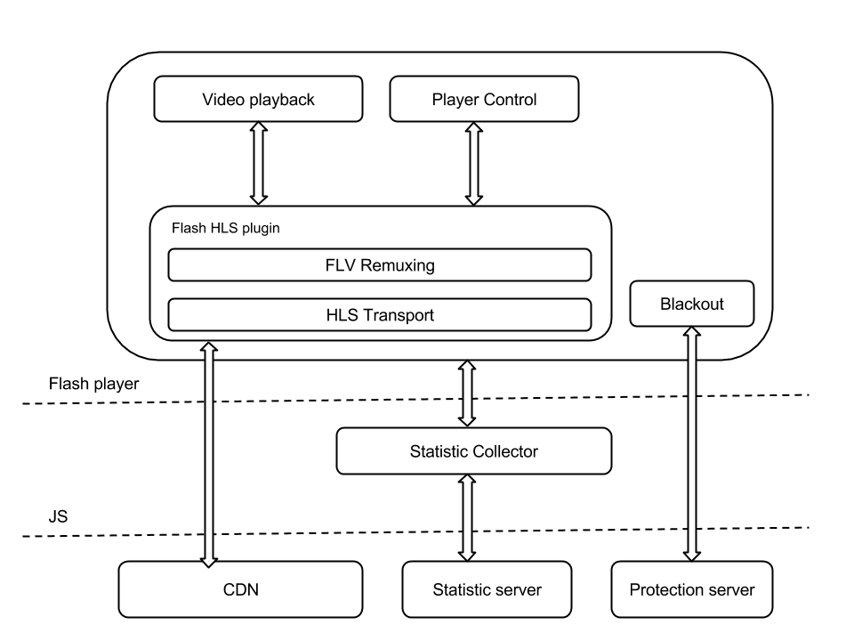
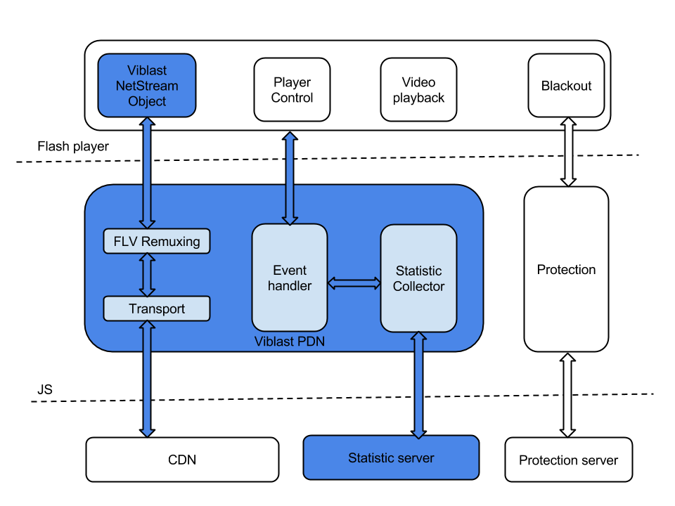
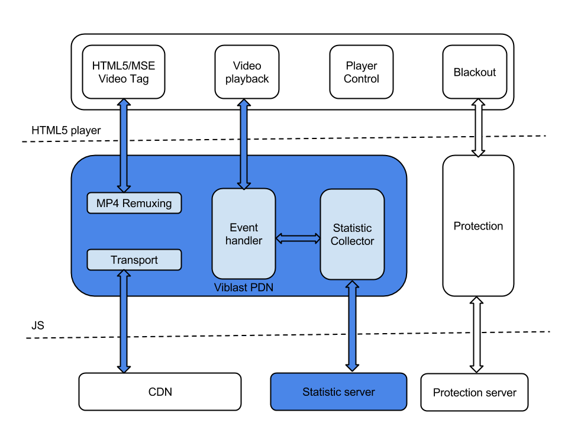

#Viblast PDN: Client Architecture Overview
#### Draft

Viblast PDN (short from peer-assisted delivery network) is designed to improve video transport while keeping the existing infrastructure the same. HLS/DASH streams served by a CDN are fetched from the client (viewer) side in the same manner as if the stream were consumed by any other player. The only difference is that the Viblast PDN transport tries to get chunks of the stream from other viewers, who are part of the PDN.

Note: How the PDN is organised is not part of this document.

There are a number of different scenarios how Viblast PDN can be integrated in the client web page.
## Flash HLS playback
A typical use case is when the web page uses Flash player with an HLS plugin integrated

The example above shows a typical stream flow using Flash. The stream is fetched by the HLS Flash plugin. It is responsible for the stream's downloading, remuxing and interaction with the Flash Video Object. Except for the stream playback, there are other important parts of the client-side logic - stream protection and gathering statistical information. Statistics could be fetched by the js module, connected to the used Flash player. Stream protection could be implemented either as a js module or as a part of the Flash player. The ABR algorithm is implemented by the plugin.

## Viblast Flash player integration
Integration of the Viblast client with a Flash player replaces the existing HLS plugin with Viblast components.

The transport part is done by the Viblast js module. It fetches the stream in the same manner as the HLS plugin from the CDN and/or Viblast PDN. Since the HLS stream contains MPEG-TS, which are not supported by Flash by default, the stream should be remuxed into flv in order to get it playable by Flash players. 

Integration with the chosen Flash player is done by the provided Viblast NetStream Object. It consumes data from the js Viblast module and interacts with the Flash video object. The ABR algorithm is implemented by the transport layer.
## Viblast HTML5 player integration
It is possible to use the Viblast client together with the HTML5 video playback capabilities. The viewer's browser should support Media Source Extensions (MSE) API. Using such a scenario eliminates the need to use Flash and can handle DRM requirements successfully.

