#Introduction  to Viblast Portal

Welcome to Viblast Portal! This document will help you get started and acquaint you with its capabilities.

##Registering

* Go to <https://portal.viblast.com>
* Click “Sign up for Viblast” to create your account.
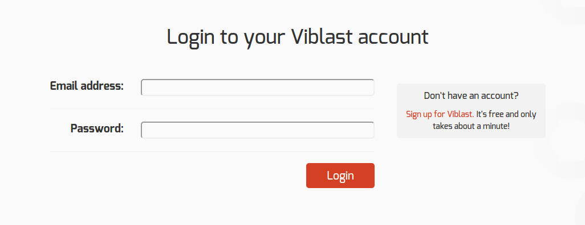

* Fill in the fields and don’t forget to check “I agree to the Terms of Service.” You can also read them if you have nothing to do today.
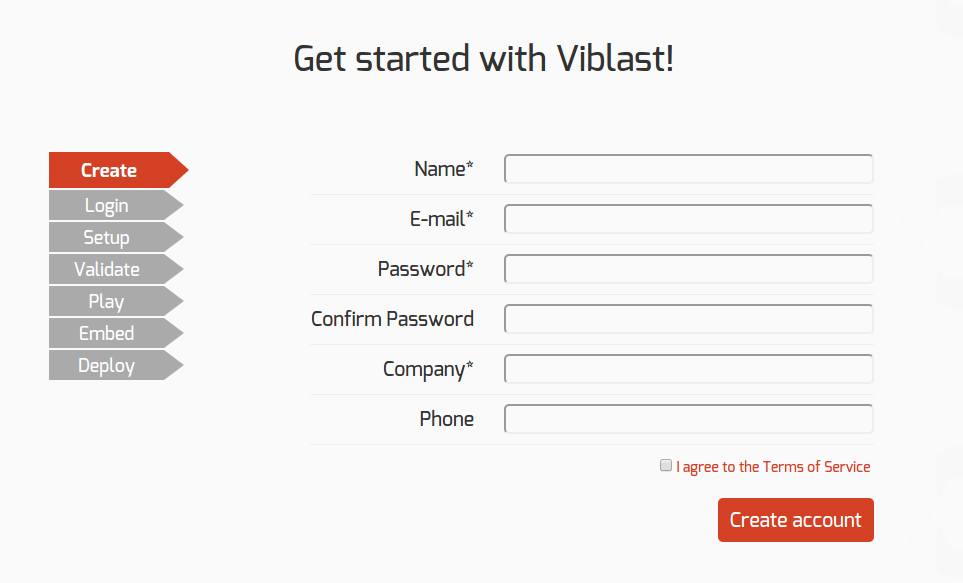
* On the next page, you will be prompted to add the domains on which you will use Viblast  PDN (where your player is located, not the URL of the stream). You can add an unlimited number of domains. Note that adding a domain includes all sub-domains.
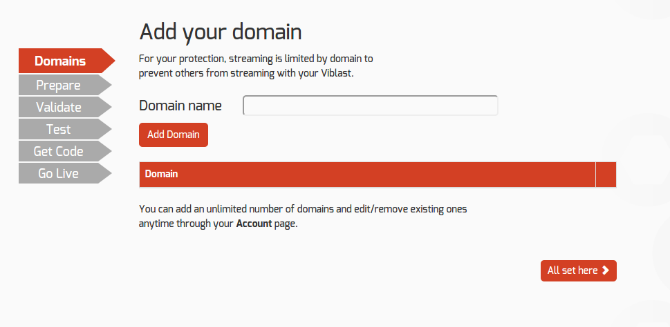

##Preparing your stream
* Now let’s get your stream ready for Viblast PDN. Make sure that:
	* You have an MPEG-DASH or HLS stream
	* Your stream is H.264 encoded with AAC audio
	* If you are using HE-AAC, additional configuration might be required. We will cover this later in the tutorial.
* Next step - set the proper headers in your server. This is a setting, which all js players require and will enable Viblast PDN js to access the stream.
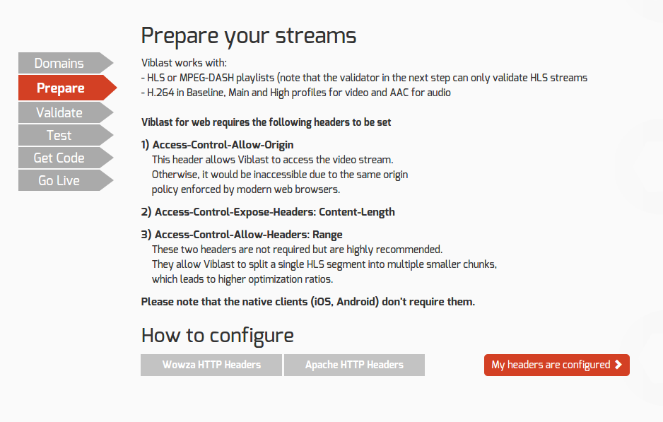
* On the validate page, you can test if your server is properly configured to send the required headers.
* This only works for HLS streams. If you are using DASH, please proceed directly to the next step
* Currently the validation only works for HTTPS streams. 
	* If you want to validate HTTP streams, go to <http://portal.viblast.com/portal/wizard/Validate>  
	Warning: **This is insecure and is not recommended**
* This validator doesn’t check the video/audio encoding of your stream, only whether the headers are properly set.
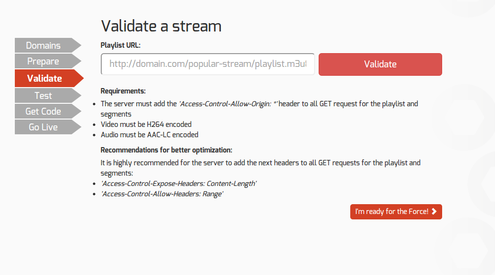
* It's time to test Viblast. Type in your stream URL and press Play.
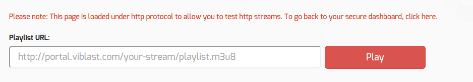
* If you see your video playing, everything is ready and you can proceed to integration with your web page via the “Get integration code” button
* If you do not see your video playing, you need to review your configuration. See the troubleshooting section below for more information.
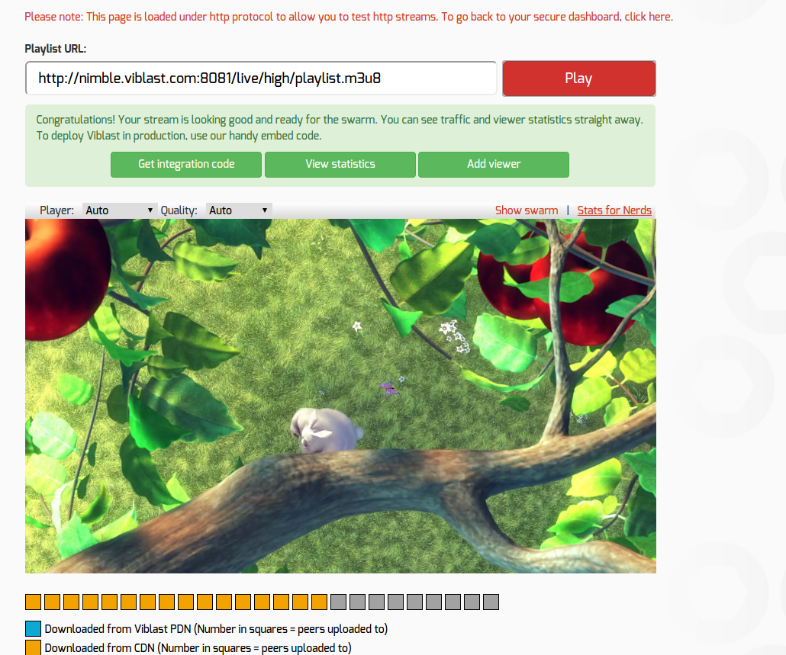

##Integrating Viblast PDN
* You are almost ready to start optimizing your video streaming!
* The last thing you have to do is add Viblast to you page.
* Select the player you want. We recommend using the HTML5 player, if possible. 
* After you select the player you want, you will see the code you need to embed Viblast PDN. See the next section for more information.
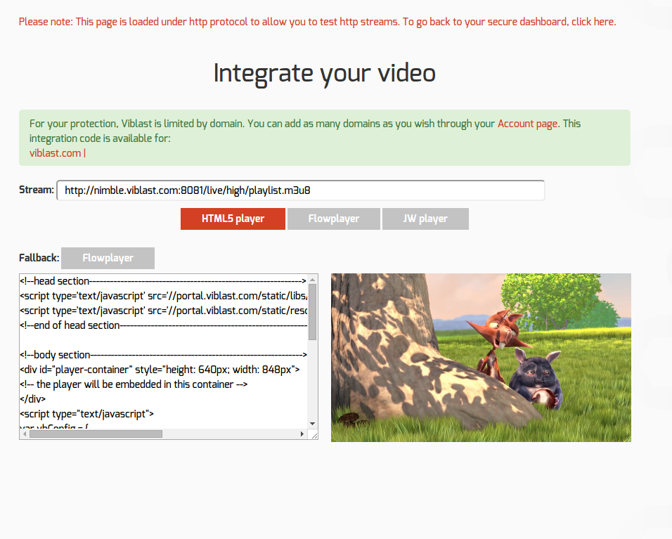

##What is domain security and why do I need it?
The viblast.js file includes a unique ID associated with your account. This allows us to correctly identify each client for billing and statistics purposes. But it also creates a potential problem - if someone acquires the js file from your page and uses it to stream video, it will be charged to your account because it is connected to your account.  
To protect our clients from this scenario, we have added an additional layer of security to Viblast PDN: Your viblast.js file will only work on the domains you yourself specify in the portal. This only concerns the page where viblast.js is included, not the domain of the stream. The result: you can play any stream on your page, and no one can use viblast.js on a different domain.

Adding more domains is simple:

* Go to Viblast Portal (<https://portal.viblast.com>)
* Click on Account and then select Domains
* Type the new domain name in the “Domain name” field and click “Add Domain”
* **If you are hosting viblast.js yourself, you need to update it**. See “Getting/Updating viblast.js” for more information
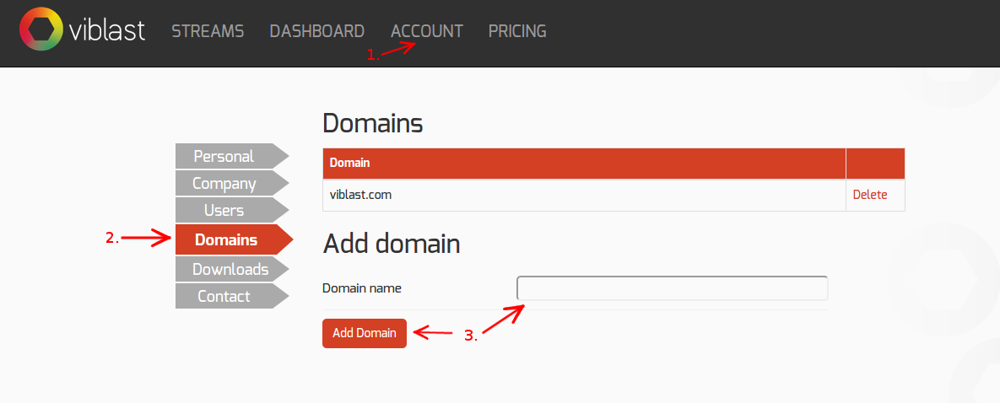

##Getting/Updating viblast.js
**This is only necessary if you want to host viblast.js yourself.**

* Go to Viblast Portal (<https://portal.viblast.com>)
* Click on Account and then select Downloads
* Select Viblast JS and click on the “Download library” button

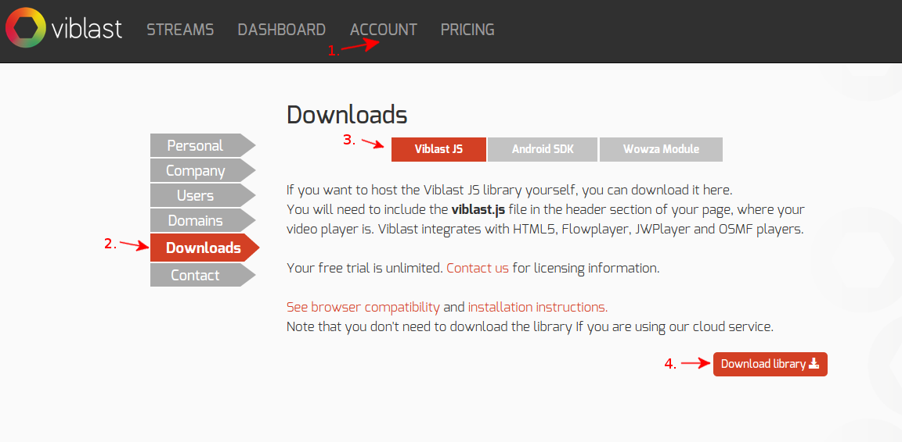

* You will receive a .zip archive containing all the necessary files.
* Extract the archive and put the files on your web server. All the files must be accessible.
* Change the header of your page to point to the location of viblast.js on your web server instead of to the viblast.js on our servers.

##Troubleshooting
Sorry to hear you are having problems with Viblast. To resolve the issue, you’ll need to open your developer console.

* On Chrome - either press “Ctrl + Shift + I” or:
	* Click on the “Customize and control Google Chrome” button in the upper right corner.
	* Click on “More tools” and then on “JavaScript Console”
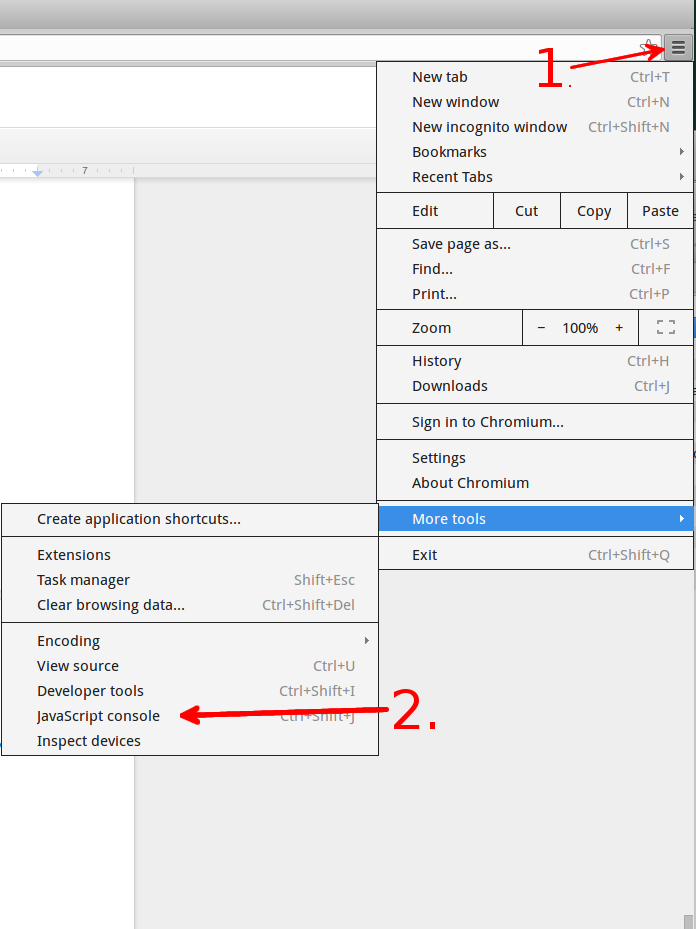
* On Firefox - either press “Ctrl + Shift + K” or:
	* Click on the “Open menu” button
	* Click on “Developer” and then on “Web Console”

1. XMLHttpRequest cannot load .... No 'Access-Control-Allow-Origin' header is present on the requested resource. Origin '...' is therefore not allowed access.
	* This is caused to missing HTTP Allow-Origin headers. Please, check here how to configure them for different web servers
2. JWPlayer shows “Error loading player: No playable sources found”
	* JWPlayer cannot be loaded. Check that you have Flash enabled and that all the required .swf files are in the right location. The developer console should display an error message if some the files are not available.
3. Range requests are not enabled for this stream. Optimisation will be better if they are!
	* The HTTP Allow-Origin headers are present, but the HTTP headers for Range Requests are missing. Check here how to configure them “”. The optimization will be dramatically improved, so it’s worth it.
4. 0% optimization/No blue squares
	* Check if your browser supports WebRTC. Currently only recent versions of Firefox and Chrome are supported.
	* Check if you have error messages in your developer console concerning the connection to the Viblast tracker.
5. Uncaught NotSupportedError: Failed to execute 'webkitGenerateKeyRequest' on 'HTMLMediaElement': The key system provided ('com.widevine.alpha') is not supported.
	* You’re using Chromium and trying to play a DRM-protected stream. DRM is only supported in Chrome and Internet Explorer 11.
6. I want to use the HTML5 Player on Firefox and Firefox supports HTML5 video!
	* Although Firefox supports HTML5 VIdeo, it currently doesn’t support the Media Source Extensions standard. This is required in order to control how video is fed to the video tag and it is a requirement for any technology that uses a different approach for retrieving the video, like P2P. It is expect to ship with Firefox 39 or 40 (Release date: 30 June 2015/11 August 2015 respectively)

