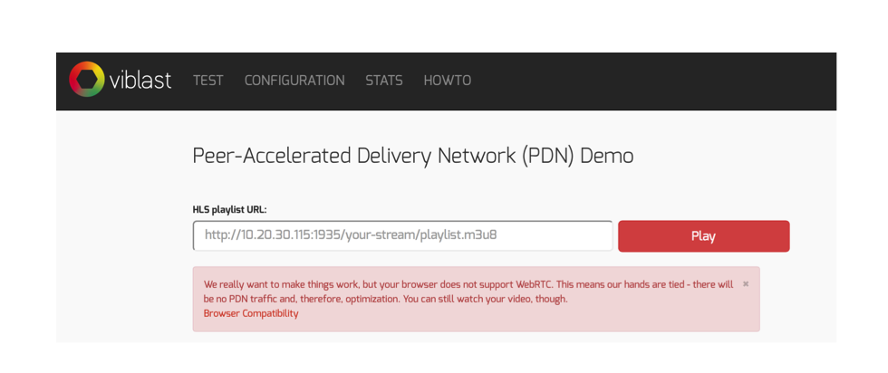

#Viblast Wowza Module


##Introduction to P2P live streaming
Viblast is an advanced peer-to-peer technology for delivering live HD video to web and mobile audiences. It is addressing the challenges of live video streaming in three important ways:

* Offloads your infrastructure, while also relieving last-mile video traffic congestion
* Offers a naturally scalable shield against service outages during viewership peaks
* Maintains high viewer quality of experience even during peaks  

And it does it elegantly:

* No end-viewer plugins or hardware to purchase
* Needs just one HLS stream to reach web & mobile audiences
* Cooperates with your infrastructure, making trial and integration a fast, efficient and seamless experience.


The Viblast Wowza Module contains the whole stack necessary to optimize live video streaming delivery. Its main components are:  

* **Viblast Wowza Tracker** – the main hub, part of your Wowza streaming engine server, which helps viewers find one another and assists P2P delivery.
* **Viblast Wowza HTTProvider** – serves resources, which enable P2P into a client’s website. It also provides access to test and sample web pages.
* **Viblast Player** – an embeddable HTML5 player that eliminates the need for multiple stream encodings for different devices and platforms. Alternatively, a pluggable solution for custom players is also available.

##How it works - Viblast Wowza Components
All Viblast components are bundled into a single jar file – viblast-wm.jar.  
The integration with Wowza is done thanks to two java classes:  

* **ViblastStarter** – a ServerListener, which turns the Viblast Tracker on when the server is started.
* **ViblastHTTPAdmin** – an HTTProvider, which serves the HTML, JS and player components of Viblast.

Once the server is started and Viblast ServerListener receives an init event, it runs the Viblast Tracker. When the tracker is running, it binds to a configurable port and starts listening for incoming connections from players (peers). When the player begins playback of a live HLS stream, it starts consuming the stream from the Wowza server and connects to the Tracker.

The tracker responds with a list of peers, which can be used as a source of the stream. Peers connect to one another and start exchanging chunks of the stream. In this way, the stream is delivered in a hybrid mode – downloading from the central Wowza server and from peers simultaneously. The set of connected peers forms a Peer-assisted Delivery Network (PDN).

The connections between the peers are built on top of the WebRTC technology. It allows two browsers (or enabled devices) to exchange data without plugins or third-party software to be installed by the end user (viewer).

On top of the PDN, which delivers the stream, is the player. If the browser supports the new MSE, the stream delivered from the PDN can be played using the video tag without a Flash player. For browsers not supporting MSE, Viblast provides plugins for most popular Flash players – Flowplayer and JW Player, thanks to the Flash NetStream object. The role of the plugin is to connect each player with the PDN. Viblast’s PDN can also be connected to any custom Flash player. 
##Installation and configuration
To install the Viblast Wowza module, place the viblast-wm.jar file into the Wowza lib folder.

###Configure the tracker
Once the jar file is copied in the appropriate folder, the components of the module should be registered with Wowza. 

The Viblast Tracker is started by the ViblastStarter Wowza server listener. The BaseClass of ViblastStarter is com.viblast.wowza.ViblastStarter. When the listener receives the signal that Wowza is inited, it reads the configuration properties and tries to start the Viblast Tracker. If there are errors, an appropriate error message will be logged in the default Wowza log. 
The configuration parameters that are passed to the Viblast Tracker are:

* **viblastTrackerNumberOfThreads** (Type:Integer) – how many threads should be used to handle peer connections. The default and recommended value is 2.
* **viblastTrackerPort** (Type:Integer) – which port should be used by the Tracker to accept peer connections. The default value is 2222.
* **viblastTrackerExternalIP** (Type:String) – specify the external IP of the tracker in case host machine of the tracker has multiple IP addresses. 
* **viblastLicenseKey** (Type:String)– the license key string of the Viblast module. If the value is empty or the license is not valid, the number of peers connected to the Tracker will be limited to 100.
* **viblastAutoStart** (Type:Boolean)– determines whether the Tracker should run when the Wowza server is started or not. The default value is “true,” but it can be changed to “false.” Manually the Tracker can be started from the configuration web page.

All these properties should be placed into the conf/Server.xml file of the Wowza server.
A simple configuration should look like this:  
Server.xml
Server.xml:

```xml
<Root>
<Server>
...
	<ServerListeners>
...
		<ServerListener>
			<BaseClass>com.viblast.wowza.ViblastStarter</BaseClass>
		</ServerListener>
...
	</ServerListeners>
...
	<Properties>
...
		<Property>
			<Name>viblastNumberOfThreads</Name>
			<Value>4</Value>
			<Type>Integer</Type>
		</Property>
       <Property>
       	<Name>viblastTrackerExternalIP</Name>
          <Value>127.0.0.1</Value>
          <Type>String</Type>
       </Property>
		<Property>
			<Name>viblastTrackerPort</Name>
			<Value>2222</Value>
			<Type>Integer</Type>
		</Property>
		<Property>
			<Name>viblastLicenseKey</Name>
			<Value>test-license</Value>
			<Type>String</Type>
		</Property>
		<Property>
			<Name>viblastAutoStart</Name>
			<Value>true</Value>
			<Type>Boolean</Type>
		</Property>
...
	</Properties>
</Server>
</Root>
```
###Configure Viblast HTTProvider
The Viblast Tracker is responsible for orchestrating the peers, forming the swarm.  
The resources needed to implement the PDN functionality on the client side are served by the Viblast HTTProvider. It should be defined within one of the VHost.xml files in order to be accessible from the web pages containing the player.  
The BaseClass of the provider is com.viblast.wowza.ViblastHTTPAdmin. A simple configuration should look like this:
VHost.xml


```xml
<Root>
	<VHost>
...
	<HostPortList>
...
	<HostPort>
		<Name>Default Streaming</Name>
       <Type>Streaming</Type>
...
	</HostPort>
   <HostPort>
		<Name>Default Admin</Name>
       <Type>Admin</Type>
...
	<HTTProviders>
...
		<HTTPProvider>
			<BaseClass>com.viblast.wowza.ViblastHTTPAdmin</BaseClass>
			<RequestFilters>viblast/static*|viblast/simple.html*</RequestFilters>
			<AuthenticationMethod>none</AuthenticationMethod>
		</HTTPProvider>
		
		<HTTPProvider>
			<BaseClass>com.viblast.wowza.ViblastHTTPAdmin</BaseClass>
			<RequestFilters>viblast*</RequestFilters>
			<AuthenticationMethod>admin-digest</AuthenticationMethod>
		</HTTPProvider>
...
	</HTTProviders>
	</HostPort>
	</HostPortList> 
...
	</VHost>
</Root>
```
*Note1: The definitions of the ViblastHTTPAdmin should be placed before the definition of HTTPServerVersion.*  

*Note2: The definitions of the ViblastHTTPAdmin should*  **be placed** *within the admin section.*  


After applying the configuration changes, the server should be restarted in order for them to take effect.
###Checking the installation
The Viblast HTTProvider serves an example test HTML page, which demonstrates the Viblast/Wowza integration.  
To access this page go to <http://[wowza-ip]:port/viblast/test.html>  
If everything is configured properly, this page should load:
If the browser does not support WebRTC, i.e. this player cannot be a part of the PDN, the following message should be displayed:

Even so, the stream would be playable via the Viblast players. For example, Internet Explorer does not support WebRTC yet, but it does support MSE. In this case, Viblast enables HLS playback within the video tag element, but without P2P acceleration.  

If everything is entered properly, playback of the given stream should start. Under the player, a row of blue, yellow or grey squares will appear, representing chunks of the stream. Yellow means that the chunk has been downloaded from the Wowza server; blue means that the chunk has been downloaded from the PDN and grey means that the chunk has not been downloaded yet.  Sometimes, a number will be displayed within a square. This number shows how many times the chunk has been uploaded by the current peer to other peers. 
 
To the right of the player, there is a “Stats” button which opens a stats display. It shows how this particular peer is connected to the PDN plus some basic stats about the amount of data exchanged between the peer and the PDN / CDN.

The configuration page displays the current Viblast module configuration and license state. 

To start or stop the Viblast Tracker, press the Start/Stop button next to *“Tracker is active.”*

The stats page displays the current Viblast module statistics.

The how-tos page contains helpful information about configuring and integrating the different Viblast components. 

##Integrating the Viblast player into a client-side webpage
The entire functionality of Viblast is bundled into a single JavaScript file, viblast.js. To enable Viblast on a webpage, this script should be included and configured.  
Viblast depends on jQuery, so it should also be included before *viblast.js*:

```html
<script src="//ajax.googleapis.com/ajax/libs/jquery/2.1.1/jquery.min.js"/>
<script src="//[wowza-ip]:[tracker-port]/viblast/static/js/viblast.js"/>

```
In the webpage HTML body, a container for the player should be defined:

```html
 <body>
	<!-- the player will be embedded in this container -->
	<div id="player-container"/> 
...
</body>

```
There are two ways to play the stream, depending on the browser:

* using the Media Source Extensions (MSE), which is supported by Chrome, Safari 8, IE11 (Windows 8). In case MSE is not supported, Flash player can be used for fallback.
* using a Flash player. In this case, Flowplayer / JW Player plugins are provided. Custom player extensions can be requested.

The Viblast configuration is a JSON object, containing all the necessary parameters. A simple configuration should look like this:

```html
<script>         
	var vbConfig = {             
		'comm-station': ‘http://[wowza-ip]:[tracker-port]’,
		'container': 'player-container',             
		'channel': {'cdnStream': 'XXXXXXXXXX.m3u8'} 
	};         
	
	Viblast.play(vbConfig);     
</script>

```
Where:

* **comm-station** - endpoint of the configured Wowza Viblast Tracker.
* **container** – points to the ID of the div containing the player.
* **channel** - contains a JSON object describing the stream. In a simple scenario, this object contains a single attribute cdnStream, pointing to the endpoint of the stream.

Once the configuration is set, it should be passed to Viblast calling the “play” method, Viblast.play(vbConfig). Calling of this method:

* Initializes Viblast
* Forces it to connect to the Tracker
* Inserts the playback element into the container element 
* Starts stream playback.

The complete HTML should look like this:

```html
<!DOCTYPE html>
<html>
<head>
    <script src="//ajax.googleapis.com/ajax/libs/jquery/2.1.1/jquery.min.js"></script>
	<script src="//[wowza-ip]:[tracker-port]/viblast/static/js/viblast.js"/>
</head>

<body>
<div id="player-container"/> 

<script>         
var vbConfig = {             
	'comm-station': ‘http://[wowza-ip]:[tracker-port]’,
	'container': 'player-container',             
	'channel': {'cdnStream': 'XXXXXXXXXX.m3u8'} 
	};         
	
Viblast.play(vbConfig);     
</script>

</body>
</html>
```

*Note: The value for cdnStream should point to a valid URL of HLS stream and values of [wowza-ip] and [tracker-port] should be changed to correspond to the real values setup.*

The example above plays the stream in browsers supporting MSE. To add Flash fallback for browsers that do not support MSE, the configuration should be extended with more parameters and additional scripts should be included. To enable Flowplayer Flash fallback, the following two Flowplayer scripts should be included:

```html
<head>
    <script src="//ajax.googleapis.com/ajax/libs/jquery/2.1.1/jquery.min.js"></script>
    <script type="text/javascript" src="static/js/viblast.js"></script>
    <script src="//[wowza-ip]:[tracker-port]/viblast/static/js/flowplayer-3.2.12.min.js"></script>
	<script src="//[wowza-ip]:[tracker-port]/viblast/static/js/flowplayer.ipad-3.2.12.min.js"></script>
</head>
```

Additionally, two parameters should be added to the configuration:

```html
var vbConfig = {
	'comm-station': ‘http://[wowza-ip]:[tracker-port]’,
            	container: 'player-container',
	'channel': {'cdnStream': 'XXXXXXXXXX.m3u8'} ,
            		attributes: {
				style: "position: relative; width:100%;"
			},
        	'only-fully-supported-envs': 'no',
};
```
Where:

* **only-fully-supported-envs** - instructs Viblast whether to run on browsers not supporting MSE or to attempt fallback.
* **attributes** - changes the attributes of the container element (Flash needs it).

More details about configuring Viblast can be found at <http://viblast.com/howtos>

 